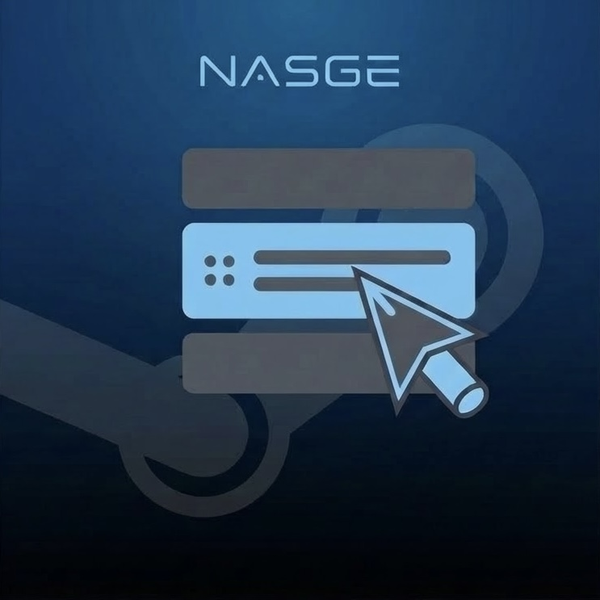
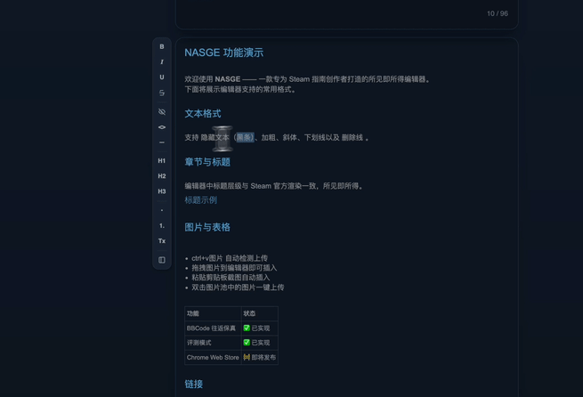
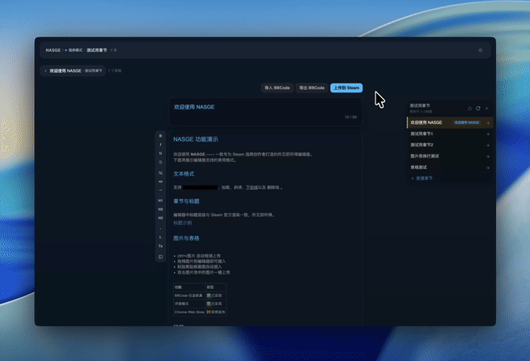
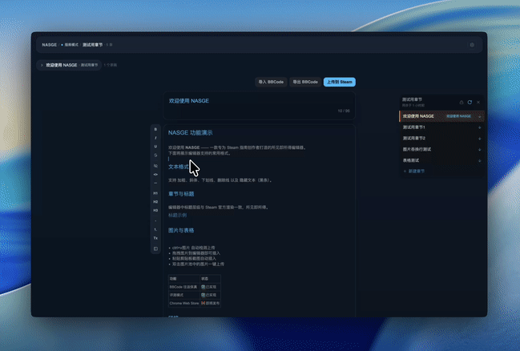

<div align="center">



# NASGE — Not A Steam Guide Editor

**A guide-creator-friendly WYSIWYG browser extension for editing Steam community guides**

[](https://github.com/JohnS3248/NASGE/releases)
[](LICENSE)
<!-- [](https://chromewebstore.google.com/detail/EXTENSION_ID) -->

**[简体中文](README.md) | English**

</div>

---

<!-- TODO: Replace placeholders with GIFs when ready -->

<div align="center">

### WYSIWYG Editor
No manual BBCode — pixel-perfect replica of Steam's official guide rendering


### Rich Formatting
Select + right-click to restyle. Bold, spoiler, underline, headings — all one click away



### Deep Customization
Fully customizable settings including keyboard shortcuts and context menu layout



### One-click Image Upload
Custom upload queue, paste-and-rename, double-click to upload


### Live Preview
Custom real-time preview algorithm, double-check before upload, see exactly what you'll get


### Chapter Management
Pull chapters, persistent draft storage, refresh-safe, never overwrites your original guide



### Offline Draft Management
Multi-guide friendly, session isolation, access archives in offline mode


### Review Mode
Write and edit Steam reviews with the same WYSIWYG experience, persistent drafts, offline support


</div>

---

<details>
<summary><strong>Table of Contents</strong></summary>

- [Why NASGE?](#why-nasge)
- [Features](#features)
- [Installation](#installation)
- [Browser Compatibility](#browser-compatibility)
- [Usage](#usage)
- [Tech Stack](#tech-stack)
- [Development](#development)
- [Contributing](#contributing)
- [Roadmap](#roadmap)
- [License](#license)

</details>

## Why NASGE?

Steam's built-in guide editor is a plain-text BBCode editor — no preview, no image management, no draft system. Writing a well-formatted guide means constantly switching between editing and previewing, wrestling with complex BBCode tags for formatting, manually uploading images one by one, and risking lost work with no auto-save.

**NASGE completely transforms the BBCode editing experience**: a full WYSIWYG editor opens in its own tab where you write in rich text. NASGE handles BBCode conversion and Steam sync behind the scenes, and you can submit and upload directly to the corresponding Steam chapter through NASGE.

## Features

- **WYSIWYG Editing** — Full rich-text editor powered by TipTap. Bold, italic, headings, lists, links, tables, spoiler tags (black bars), blockquotes — all rendered visually, aligned with official guide styling
- **Chapter Management** — View all chapters in a sidebar, drag to reorder, pull from / push to Steam with one click, never overwrites your original guide chapters
- **Image Pool** — Browse your guide's uploaded images in a floating panel. Search, filter by tags, paste-and-rename, one-click insert. Drag into the image pool and right-click to change format
- **Review Mode** — Write and publish Steam game reviews with the same WYSIWYG experience. Recommend/not-recommend, visibility, language settings all in one panel
- **Multi-theme** — Three built-in themes: steam-dark, midnight, classic. Follows your preference across sessions
- **Drafts & Archives** — Multi-guide and review editing friendly. Auto-saved local drafts + manual archive snapshots. Never lose work again
- **Offline Mode** — Create and edit drafts without a Steam connection. Sync when you're ready
- **i18n** — Multi-language support, launching with Chinese and English, auto-detects browser language
- **BBCode Roundtrip Fidelity** — `BBCode → HTML → BBCode` produces semantically equivalent output. Your formatting is preserved, not "normalized"

## Installation

### Chrome Web Store (Recommended)

<!-- TODO: Chrome Web Store 上架后替换链接 -->
> Coming soon — the extension is preparing for its first public release.

### Manual Install (Developer)

1. Clone the repository
   ```bash
   git clone https://github.com/JohnS3248/NASGE.git
   cd NASGE
   npm install
   ```
2. Build the extension
   ```bash
   npm run build
   ```
3. Load in Chrome
   - Open `chrome://extensions`
   - Enable **Developer mode** (top right)
   - Click **Load unpacked** → select the `dist/` folder

## Browser Compatibility

| Browser | Status | Notes |
|---------|--------|-------|
| Google Chrome | Full support | Manifest V3, requires Chrome 88+ |
| Microsoft Edge | Works | Chromium-based, same load-unpacked method |
| Firefox | Not supported | MV3 differences, planned for future (see Roadmap) |
| Other Chromium browsers | Untested | Brave, Opera, Vivaldi should work in theory |

## Usage

1. Navigate to any Steam guide editing page (`steamcommunity.com/sharedfiles/manageguide/...`)
2. Click the NASGE extension icon → **Edit Guide**
3. A new tab opens with the WYSIWYG editor
4. Edit your guide → click **Push** to sync chapters back to Steam

**Review mode**: Navigate to any Steam store page, click the extension icon → **Edit Review** to edit an existing review or write a new one.

**Offline mode**: Click the extension icon → **Offline Guide** or **Offline Review** to edit drafts without opening a Steam page. Sync when you're ready.

## Tech Stack

| Category | Technology |
|----------|------------|
| UI Framework | React 19 |
| Rich-text Editor | TipTap 3 (ProseMirror) |
| State Management | Zustand 5 |
| Styling | Tailwind CSS 4 |
| Language | TypeScript 5 (strict mode) |
| Build | Vite 7 + @crxjs/vite-plugin |
| i18n | i18next + react-i18next |
| Extension | Chrome Manifest V3 |

## Development

```bash
# Install dependencies
npm install

# Dev server (editor UI iteration only, not a loadable extension)
npm run dev

# Watch mode (load dist/ as unpacked extension for real testing)
npm run dev:extension

# Type check
npm run type-check

# Run tests
npm run test

# Production build
npm run build
```

### Architecture

```
src/
├── editor/          # Main editor app (opens in its own tab)
│   ├── components/  # React components
│   ├── extensions/  # Custom TipTap extensions (steamImage, spoiler, etc.)
│   ├── stores/      # Zustand stores
│   ├── services/    # Steam API bridge, image upload, chapter sync
│   └── utils/       # BBCode converter, utilities
├── content/         # Content scripts injected into steamcommunity.com
├── background/      # Service worker (message relay)
├── popup/           # Extension popup UI
├── i18n/            # Internationalization resources
└── shared/          # Shared types, logger, message protocol
```

Communication flow: **Editor tab** ↔ `chrome.runtime` ↔ **Background SW** ↔ **Content script** ↔ **Steam page DOM**

## Contributing

1. Fork the repo & create a branch (`git checkout -b feat/my-feature`)
2. `npm install && npm run dev:extension`
3. Load `dist/` as unpacked extension in Chrome
4. Make changes → `npm run build` → verify manually
5. Submit a PR

Bug reports and feature requests are welcome on [GitHub Issues](https://github.com/JohnS3248/NASGE/issues).

See [CONTRIBUTING_en.md](CONTRIBUTING_en.md) for detailed guidelines.

## Roadmap

- [x] WYSIWYG BBCode editor with roundtrip fidelity
- [x] Chapter management & Steam sync
- [x] Image pool & upload
- [x] Review mode
- [x] Multi-theme support (steam-dark / midnight / classic)
- [x] Draft & archive system
- [x] i18n (zh-CN + en-US)
- [ ] Onboarding tour for new users
- [ ] Chrome Web Store listing
- [ ] Firefox support
- [ ] More languages (contributions welcome!)

## License

MIT License — see [LICENSE](LICENSE) for details.

For our privacy statement, see [PRIVACY_en.md](PRIVACY_en.md).

---

<div align="center">

**[Report Bug](https://github.com/JohnS3248/NASGE/issues)** · **[Request Feature](https://github.com/JohnS3248/NASGE/issues)**

</div>
